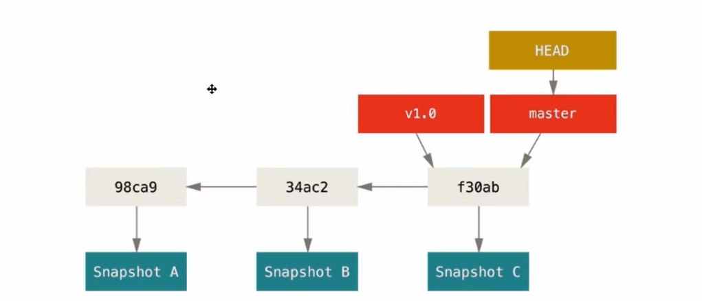
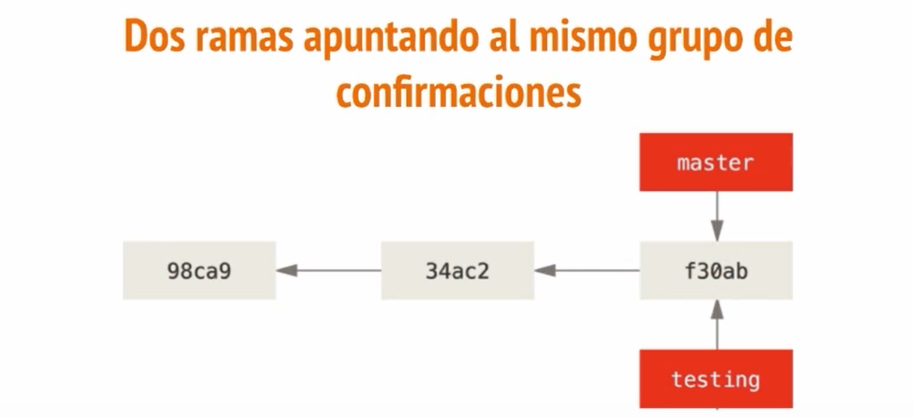
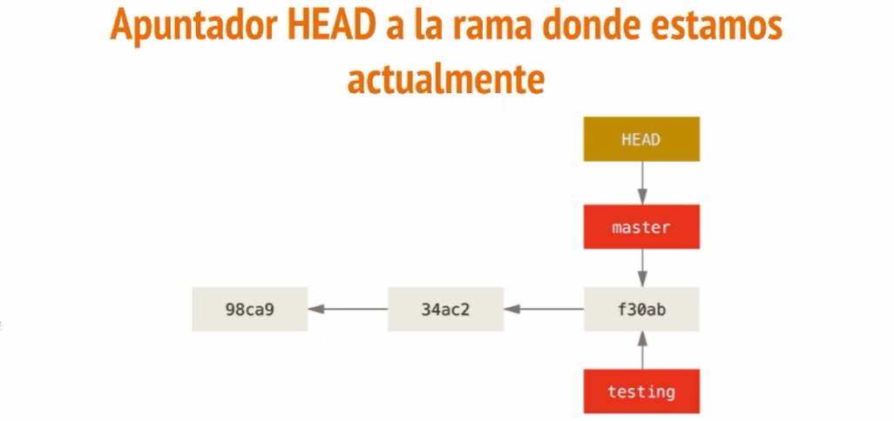
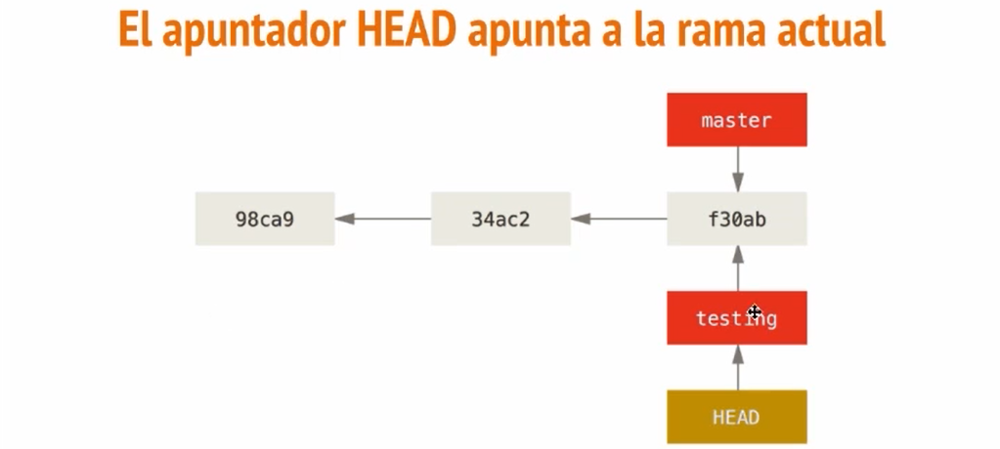
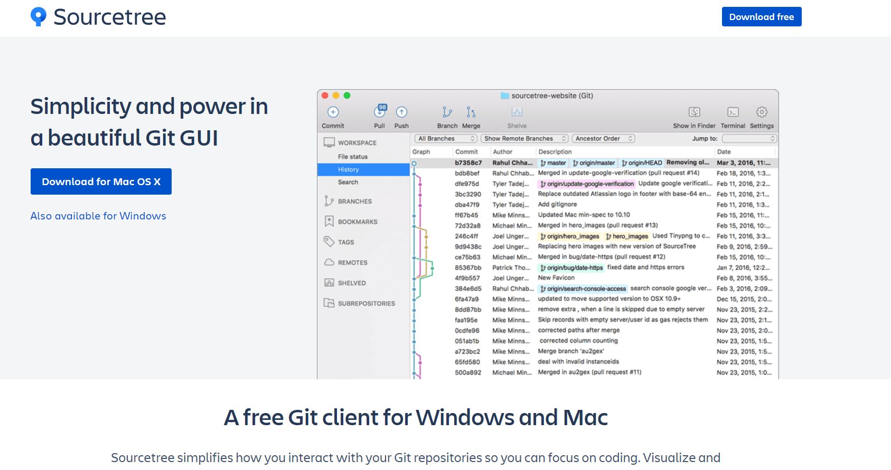

# Git

[Regresar](./README.md)

# Introducción

> Es un Sistema de control de versiones para el mantenimiento eficiente y confiable de nuestros trabajos o proyectos... c:

## ¿Qué es?

* Es un sistema de control de versiones 
* Es el mas usado en la actualidad 
* El creador es Linus Torvalds
* Git es gratuito y opensource
* Git es usado en trabajos colaborativos


> Un **sistema de control de versiones** nos permite hacer un seguimiento de los cambios que apliquemos a nuestros proyectos, entonces a medida que vayamos haciendo cambios estas quedaran grabadas en nuestro repositorio. Asi, si cometimos algun error en un cambio podremos regresar al cambio anterior...

> Puedes emplearlo para casi cualquier tipo de archivo que encuentres en un ordenador. Si eres diseñador gráfico o web, y quieres mantener cada versión de una imagen o diseño (algo que sin duda quieres), un sistema de control de versiones (Version Control System o VCS en inglés) es una elección muy sabia.

> Normalmente cuando nosotros tenemos un proyecto en desarrollo tenemos varias carpetas que funcionan o almacenan nuestros backup, esto resulta muy confuso a la hora de manejar nombres de carpetas... con Git solucionamos esto.

**Git permite la creacion de ramas**
* Esto ayuda a que algunas ramas esten en evolución, otras en desarrollo otras en finalización.
* En estos aspectos las ramas ayudan a trabajar modularmente.

## Estructura

Git tiene tres estados principales en los que se pueden encontrar tus archivos: **confirmado (committed)**, **modificado (modified)**, y **preparado (staged)**. Confirmado significa que los datos están almacenados de manera segura en tu base de datos local. Modificado significa que has modificado el archivo pero todavía no lo has confirmado a tu base de datos. Preparado significa que has marcado un archivo modificado en su versión actual para que vaya en tu próxima confirmación.

Esto nos lleva a las tres secciones principales de un proyecto de Git: el directorio de Git (Git directory), el directorio de trabajo (working directory), y el área de preparación (staging area).


1. Working Directory | Directorio de Trabajo 
   * El directorio de trabajo es una copia de una versión del proyecto. Estos archivos se sacan de la base de datos comprimida en el directorio de Git, y se colocan en disco para que los puedas usar o modificar.
   * Contiene todos nuestros archivos de trabajo para añadir a staging area se usa el comando " git add "

2. Staging Area | Area de Preparación
   * El área de preparación es un sencillo archivo, generalmente contenido en tu directorio de Git, que almacena información acerca de lo que va a ir en tu próxima confirmación. A veces se denomina el índice, pero se está convirtiendo en estándar el referirse a ello como el área de preparación.
   * Observamos algunos archivos de nuestro trabajo que estan en cambios. 
   * Esta es la seccion de actualizaciones para añadir archivos al repositorio se usa el comando " git commit "

3. Repository | Repositorio
   * El directorio de Git es donde Git almacena los metadatos y la base de datos de objetos para tu proyecto. Es la parte más importante de Git, y es lo que se copia cuando clonas un repositorio desde otro ordenador.
   * Applicando un " commit " tenemos nuestro repositorio actualizado

## Flujo de Trabajo

1. Modificas una serie de archivos en tu directorio de trabajo.
2. Preparas los archivos, añadiendo instantáneas de ellos a tu área de preparación
3. Confirmas los cambios, lo que toma los archivos tal y como están en el área de preparación, y almacena esa instantánea de manera permanente en tu directorio de Git.

> Si una versión concreta de un archivo está en el directorio de Git, se considera confirmada (committed). Si ha sufrido cambios desde que se obtuvo del repositorio, pero ha sido añadida al área de preparación, está preparada (staged). Y si ha sufrido cambios desde que se obtuvo del repositorio, pero no se ha preparado, está modificada (modified).

# Instalación y Configuración de Git

## Instalación

Video (https://youtu.be/ES2xtLyI-B8)

1. Para descargar git (https://git-scm.com/downloads) 

#### Configuración

1. Accedemos a nuestra terminal git-bash para editar nuestra identidad, editor de texto y más usamos el comando `git config`
* Configuramos el **nombre de usuario**
```
git config --global user.name "jdpoccorie"
```
* Configuramos el **email del Usuario** 
```
git config --global user.email "juandiego.poccori@gmail.com"
```
* Para poner en el **editor** e sublime text2 !Recomendable
```
git config --global core.editor "'c:/program files/sublime text 2/sublime_text.exe' -w"
```
* Para poner en el **editor** de sublime text 3
```
git config --global core.editor "'c:/program files/sublime text 3/subl.exe' -w"
```
* Verificamos si configuramos correctamente
```
git config --global --list
git config user.name
```
* Listo!!!

## Comandos para obtener ayuda

Si alguna vez necesitas ayuda usando Git, hay tres formas de ver la página del manual (manpage) para cualquier comando de Git:
```
git help <comando>
git <comando> --help
man git-<comando>
```
Por ejemplo, puedes ver la página del manual para el comando config ejecutando:
```
git help config
```
> Podemos ver la info de los comandos incluso sin conexión

# Creando nuestro primer Repositorio

Un **repositorio** es un lugar de almacenamiento del cual pueden ser recuperados e instalados los paquetes de software en un ordenador.

## El ciclo de vida del estado de nuestros archivos
* Untracked (No Rastreados | Sin seguimiento)
* Unmodified
* Modified
* Stanged

UNTRACKED | UNMODIFIED | MODIFIED | STAGED
------------ | ------------- | ------------- | -------------
Por defecto los archivos de nuestra carpeta no estaran marcados o rastreados por asi decirlo. | Una vez pasados por Untracked estos archivos estaran como no modificados, al estar asi nosotros no podremos enviarlos al staged area. | Nuestros archivos al ser editados pasan a modified. | Haciendo un stage the file pasan a staged area.


1. Al estar en el **staged area**.
   1. Hacemos un commit y estos archivos se registraran pasando al repositorio a estar como archivos unmodified(no modificados) de una nueva version 
   2. Finalmente si nosotros queremos dejar de ver algunos archivos podemos eliminarlos de nuestro repositorio y pasar nuevamente a estar no marcados untracked...
2. Tambien veremos un comando `status` que nos permitira saber el estado de nuestros archivos.

**Inicializando un repositorio en un directorio existente**

Si estás empezando el seguimiento en Git de un proyecto existente, necesitas ir al directorio del proyecto y escribir:
```
git init
```
Esto crea un nuevo subdirectorio llamado .git que contiene todos los archivos necesarios del repositorio — un esqueleto de un repositorio Git.

**Clonando un repositorio existente**

Si deseas obtener una copia de un repositorio Git existente — por ejemplo, un proyecto en el que te gustaría contribuir — el comando que necesitas es `git clone [url]`

```
git clone git://github.com/schacon/grit.git
```

**Práctica**

Comandos que usaremos
* `git init`
* `git status`
* `git add [archivo]`
* `git add .` agrega todos los archivos a la zona de preparacion esten o no en dicha zona
* `git add -A` agrega todos los archivos que ya estamos siguiendo
* `git commit -m "mssge"`
* `git log`
* `git diff` Para ver los cambios en la zona de archivos no preparados
* `git diff --staged` Para ver los cambios en la zona de preparacion
* `git reset HEAD Readme.md` Para quitar de la zona de preparación, tambien se puede usar `git restore --staged <file>`
* `git commit --amend` Nos permite cambiar el mensaje del último commit que se hizo

1. Para empezar crearemos una carpeta llamada Proyecto y accederemos a ella con la terminal e iniciaremos git con el comando `git init`
2. Crearemos un archivo *Readme.md* y editaremos el archivo
3. Escribimos `git status` y nos aparecera el archivo Readme como UNTRACKED
4. Preparamos el archivo con `git add Readme.md`
5. Para confirmar los cambios `git commit -m "(msg)Commit inicial"`
6. Para ver mis confirmaciones que hicimos usamos `git log`
7. Volvemos a editar el archivo y para ver las diferencias con el archivo antiguo usamos `git diff`
8. Estos son algunos comando básicos para entender el ciclo de vida de los estados, es muy importante tener claro esto

> **Hacer un commit usando el editor configurado en git** Podemos usar el comando `git commit` sin la opcion `-m` y automaticamente se nos abrira el editor, que pasa si queremos usar la opción `-m` pero escribir n-líneas, pues simplemente abrimos comillas y damos enter sin cerrarlas esto git entendera como que queremos seguir escribiendo mas contenido, osea esperará que cerremos las comillas.

## Ignorando archivos

A menudo tendrás un tipo de archivos que no quieras que Git añada automáticamente o te muestre como no versionado. Suelen ser archivos generados automáticamente, como archivos de log, o archivos generados por tu compilador. Para estos casos puedes crear un archivo llamado `.gitignore`, en el que listas los patrones de nombres que deseas que sean ignorados. He aquí un archivo `.gitignore` de ejemplo:
```
*.[oa]
*~
```
La primera línea le dice a Git que ignore cualquier archivo cuyo nombre termine en `.o` o `.a` — archivos objeto que suelen ser producto de la compilación de código. La segunda línea le dice a Git que ignore todos los archivos que terminan en tilde (`~`).

> Configurar un archivo `.gitignore` antes de empezar a trabajar suele ser una buena idea, para así no confirmar archivos que no quieres en tu repositorio Git.

Las reglas para los patrones que pueden ser incluidos en el archivo `.gitignore` son:
* Las líneas en blanco, o que comienzan por `#`, son ignoradas.
* Puedes usar patrones glob estándar.
* Puedes indicar un directorio añadiendo una barra hacia delante (`/`) al final.
* Puedes negar un patrón añadiendo una exclamación (`!`) al principio.

Los patrones glob son expresiones regulares simplificadas que pueden ser usadas por las shells. Un asterisco (`*`) reconoce cero o más caracteres; `[abc]` reconoce cualquier carácter de los especificados entre corchetes (en este caso, `a`, `b`, o `c`); una interrogación (`?`) reconoce un único carácter; y caracteres entre corchetes separados por un guión (`[0-9]`) reconoce cualquier carácter entre ellos (en este caso, de `0` a `9`).

He aquí otro ejemplo de archivo `.gitignore`:

```
# a comment – this is ignored
*.a       # no .a files
!lib.a    # but do track lib.a, even though you're ignoring .a files above
/TODO     # only ignore the root TODO file, not subdir/TODO
build/    # ignore all files in the build/ directory
doc/*.txt # ignore doc/notes.txt, but not doc/server/arch.txt
```
> Una buena herramienta para generar estos arvhivos es `https://www.gitignore.io/`

## Saltando el área de preparación

Para saltarnos el área de preparación y confirmar las modificaciones usamos el siguiente comando `git commit -a -m`.

> Tener en cuenta de que el comando anterior solo agrega automaticamente al area de preparación todos los archivos que estamos siguiendo actualmente, es decir los archivos nuevos o untracked como arapece no seran agregados al log de git

## Eliminando archivos

Para eliminar un archivo de Git, debes eliminarlo de tus archivos bajo seguimiento (más concretamente, debes eliminarlo de tu área de preparación), y después confirmar. El comando `git rm`se encarga de eso, y también elimina el archivo de tu directorio de trabajo, para que no lo veas entre los archivos sin seguimiento.

Si simplemente eliminas el archivo de tu directorio de trabajo, aparecerá bajo la cabecera “Modificados pero no actualizados” (“Changed but not updated”) (es decir, sin preparar) de la salida del comando `git status`:

(https://uniwebsidad.com/libros/pro-git/capitulo-2/guardando-cambios-en-el-repositorio)

## Moviendo archivos, renombrando archivos

A diferencia de muchos otros VCSs, Git no hace un seguimiento explicito del movimiento de archivos. Si renombras un archivo, en Git no se almacena ningún metadato que indique que lo has renombrado. Sin embargo, Git es suficientemente inteligente como para darse cuenta — trataremos el tema de la detección de movimiento de archivos un poco más adelante —.

Por tanto, es un poco desconcertante que Git tenga un comando mv. Si quieres renombrar un archivo en Git, puedes ejecutar algo así:
```
git mv file_from file_to
```
Y funciona perfectamente. De hecho, cuando ejecutas algo así y miras la salida del comando status, verás que Git lo considera un archivo renombrado.

Sin embargo, esto es equivalente a ejecutar algo así:
```
mv README.txt README
git rm README.txt
git add README
```
Git se da cuenta de que es un renombrado de manera implícita, así que no importa si renombras un archivo de este modo, o usando el comando `mv`. La única diferencia real es que `mv` es un comando en vez de tres — es más cómodo —. Y lo que es más importante, puedes usar cualquier herramienta para renombrar un archivo, y preocuparte de los `add` y `rm` más tarde, antes de confirmar.

(https://uniwebsidad.com/libros/pro-git/capitulo-2/guardando-cambios-en-el-repositorio)

## Viendo el historial en git

El comando `git-log` nos uestra el historial de confirmaciones.

Entre las opciones del comando podemos encontrar:
* `--oneline`: nos muestra el historial abreviado
* `--graph` añade un pequeño gráfico ASCII mostrando el historial de ramificaciones y uniones.
```
git log --oneline
git log --graph
git log --oneline --graph
```

Para limitar cuantos commits queremos ver usamos `git log -n`, por ejemplo las 2 ultimas confirmaciones:
```
git log -2
```

Podemos ver infinidad de combinaciones de como queremos ver nuestro historial, para eso se puede revisar el comando `git log --help` un ejemplo:
```
git log --pretty=format:"%h - %an, %ar : %s"
```

Para usar los comodines de %h - hash, %an - autor, %ar - fecha, %s - mensaje, debemos revisar la documentación.
```
649f588 - jdpoccorie, 2 days ago : Update gitgnore secreto.md
e7f52dc - jdpoccorie, 2 days ago : Creado el gitignore
c725d76 - jdpoccorie, 2 days ago : Flujo de trabajo modificado
70d0279 - jdpoccorie, 2 days ago : Commit inicial
```

Listar los commits con un rango de fechas usamos:
```
git log --after="2020-11-14 00:00:00"
git log --before="2020-11-14 00:00:00"
git log --after="2020-11-14 11:00:00 --before="2020-11-15 11:30:00"
```
Otra opción realmente útil es `--pretty`, que modifica el formato de la salida. Tienes unos cuantos estilos disponibles. La opción `oneline` imprime cada confirmación en una única línea, lo que puede resultar útil si estás analizando gran cantidad de confirmaciones. Otras opciones son `short`, `full` y `fuller`, que muestran la salida en un formato parecido, pero añadiendo menos o más información, respectivamente:
```
git log --pretty=oneline
```
La opción más interesante es `format`, que te permite especificar tu propio formato. Esto resulta especialmente útil si estás generando una salida para que sea analizada por otro programa — como especificas el formato explícitamente, sabes que no cambiará en futuras actualizaciones de Git
```
git log --pretty=format:"%h - %an, %ar : %s"
ca82a6d - Scott Chacon, 11 months ago : changed the version number
085bb3b - Scott Chacon, 11 months ago : removed unnecessary test code
a11bef0 - Scott Chacon, 11 months ago : first commit
```

La Tabla lista algunas de las opciones más útiles aceptadas por `format`.

|Opción | Descripción de la salida |
|------ | ------------------------ |
|%H     | Hash de la confirmación  |
|%h     | Hash de la confimación abreviado |
|%T     | Hash del árbol           |
|%t     | Hash del arbol abreviado |
|%P     | Hashes de las confirmaciones padre |
|%p     | Hashes de las confirmaciones padre abreviadas |
|%an    | Nombre del autor         |
|%ae    | Dirección de correo del autor |
|%ad    | Fecha de autoría (el formato respeta la opción `--date`) |
|%ar    | Fecha de autoría, relativa |
|%cn    | Nombre del confirmador     |
|%ce    | Dirección de correo del confirmador |
|%cd    | Fecha de confirmación      |
|%cr    | Fecha de confirmación, relativa |
|%s     | Asunto                     |

Puede que te estés preguntando la diferencia entre autor (author) y confirmador (committer). El autor es la persona que escribió originalmente el trabajo, mientras que el confirmador es quien lo aplicó. Por tanto, si mandas un parche a un proyecto, y uno de sus miembros lo aplica, ambos recibiréis reconocimiento — tú como autor, y el miembro del proyecto como confirmador.

```
git log --pretty=format:"%h %s" --graph
```

existen muchas mas:

|Opción | Descripción de la salida |
|------ | ------------------------ |
| `-p` | Muestra el parche introducido en cada confirmación. |
| `--stat` | Muestra estadísticas sobre los archivos modificados en cada confirmación. |
| `--shortstat` | Muestra solamente la línea de resumen de la opción `--stat`.           |
| `--name-only` | Muestra la lista de archivos afectados |
| `--name-status` | Muestra la lista de archivos afectados, indicando además si fueron añadidos, modificados o eliminados. |
| `--abbrev-commit` | Muestra solamente los primeros caracteres de la suma SHA-1, en vez de los 40 caracteres de que se compone. |
| `--relative-date` | Muestra la fecha en formato relativo (por ejemplo, “2 weeks ago” (“hace 2 semanas”)) en lugar del formato completo. |
| `--graph` | Muestra un gráfico ASCII con la historia de ramificaciones y uniones. |
| `--pretty` | Muestra las confirmaciones usando un formato alternativo. Posibles opciones son `oneline`, `short`, `full`, `fuller`, y format (mediante el cual puedes especificar tu propio formato). |

### Limitando la salida del histórico

Además de las opciones de formateo, `git log` acepta una serie de opciones para limitar su salida — es decir, opciones que te permiten mostrar únicamente parte de las confirmaciones. Ya has visto una de ellas, la opción `-2`, que muestra sólo las dos últimas confirmaciones. De hecho, puedes hacer `-<n>`, siendo `n` cualquier entero, para mostrar las últimas n confirmaciones. En realidad es poco probable que uses esto con frecuencia, ya que Git por defecto pagina su salida para que veas cada página del histórico por separado.

Sin embargo, las opciones temporales como `--since` (desde) y `--until` (hasta) sí que resultan muy útiles. Por ejemplo, este comando lista todas las confirmaciones hechas durante las dos últimas semanas:
```
git log --since=2.weeks
```
Este comando acepta muchos formatos. Puedes indicar una fecha concreta (“2008-01-15”), o relativa, como _“2 years 1 day 3 minutes ago”_ (“hace 2 años, 1 día y 3 minutos”).

También puedes filtrar la lista para que muestre sólo aquellas confirmaciones que cumplen ciertos criterios. La opción `--author` te permite filtrar por autor, y `--grep` te permite buscar palabras clave entre los mensajes de confirmación. (Ten en cuenta que si quieres aplicar ambas opciones simultáneamente, tienes que añadir `--all-match`, o el comando mostrará las confirmaciones que cumplan cualquiera de las dos, no necesariamente las dos a la vez.)

La última opción verdaderamente útil para filtrar la salida de git log es especificar una ruta. Si especificas la ruta de un directorio o archivo, puedes limitar la salida a aquellas confirmaciones que introdujeron un cambio en dichos archivos. Ésta debe ser siempre la última opción, y suele ir precedida de dos guiones (--) para separar la ruta del resto de opciones.

En la Tabla se listan estas opciones, y algunas otras bastante comunes, a modo de referencia.

|Opción | Descripción de la salida |
|------ | ------------------------ |
| `-(n)` | Muestra solamente las últimas n confirmaciones |
| `--since, --after` | Muestra aquellas confirmaciones hechas después de la fecha especificada. |
| `--until, --before` | Muestra aquellas confirmaciones hechas antes de la fecha especificada. |
| `--author` | Muestra sólo aquellas confirmaciones cuyo autor coincide con la cadena especificada. |
| `--committer` | Muestra sólo aquellas confirmaciones cuyo confirmador coincide con la cadena especificada. |

Por ejemplo, si quieres ver cuáles de las confirmaciones hechas sobre archivos de prueba del código fuente de Git fueron enviadas por el usuario **gitster**, y no fueron fusiones, en el mes de octubre de 2008, ejecutarías algo así:
```
git log --pretty="%h - %s" --author=gitster --since="2008-10-01" \
   --before="2008-11-01" --no-merges -- t/
```

## Comandos para deshacer

En cualquier momento puedes querer deshacer algo. En esta sección veremos algunas herramientas básicas para deshacer cambios. Ten cuidado, porque no siempre puedes volver atrás después de algunas de estas operaciones. Ésta es una de las pocas áreas de Git que pueden provocar que pierdas datos si haces las cosas incorrectamente.

### Modificando tu última confirmación

Uno de los casos más comunes en el que quieres deshacer cambios es cuando confirmas demasiado pronto y te olvidas de añadir algún archivo, o te confundes al introducir el mensaje de confirmación. Si quieres volver a hacer la confirmación, puedes ejecutar un `commit` con la opción `--amend`:
```
git commit --amend
```

Este comando utiliza lo que haya en tu área de preparación para la confirmación. Si no has hecho ningún cambio desde la última confirmación (por ejemplo, si ejecutas este comando justo después de tu confirmación anterior), esta instantánea será exactamente igual, y lo único que cambiarás será el mensaje de confirmación.

Se lanzará el editor de texto para que introduzcas tu mensaje, pero ya contendrá el mensaje de la confirmación anterior. Puedes editar el mensaje, igual que siempre, pero se sobreescribirá tu confirmación anterior.

Por ejemplo, si confirmas y luego te das cuenta de que se te olvidó preparar los cambios en uno de los archivos que querías añadir, puedes hacer algo así:

```
git commit -m 'initial commit'
git add forgotten_file
git commit --amend
```
Estos tres comandos acabarán convirtiéndose en una única confirmación — la segunda confirmación reemplazará los resultados de la primera

### Deshaciendo la preparación de un archivo

Las dos secciones siguientes muestran como pelearse con las modificaciones del área de preparación y del directorio de trabajo. Lo bueno es que el comando que usas para determinar el estado de ambas áreas te recuerda como deshacer sus modificaciones. Por ejemplo, digamos que has modificado dos archivos, y quieres confirmarlos como cambios separados, pero tecleas accidentalmente `git add *` y preparas ambos. ¿Cómo puedes sacar uno de ellos del área de preparación? El comando `git status` te lo recuerda:
```
Changes to be committed:
    (use "git restore --staged <file>..." to unstage)
    ...
```

### Deshaciendo la modificación de un archivo

¿Qué pasa si te das cuenta de que no quieres mantener las modificaciones que has hecho sobre el archivo? ¿Cómo puedes deshacerlas fácilmente — revertir el archivo al mismo estado en el que estaba cuando hiciste tu última confirmación — (o cuando clonaste el repositorio, o como quiera que metieses el archivo en tu directorio de trabajo)? Afortunadamente, `git status` también te dice como hacer esto. En la salida del último ejemplo, la cosa estaba así:
```
Changes not staged for commit:
  (use "git add <file>..." to update what will be committed)
  (use "git restore <file>..." to discard changes in working directory)
```
Antes tambien se usaba `git checkout -- <file>`

> Nunca uses este comando a no ser que estés absolutamente seguro de que no quieres el archivo. Si lo único que necesitas es olvidarte de él momentáneamente, veremos los conceptos de apilamiento (stashing) y ramificación (branching) en el próximo capítulo; en general son formas más adecuadas de trabajar.

## Etiquetas (Tags)

Como muchos VCSs, Git tiene la habilidad de etiquetar (tag) puntos específicos en la historia como importantes. Generalmente la gente usa esta funcionalidad para marcar puntos donde se ha lanzado alguna versión (v1.0, y así sucesivamente). En esta sección aprenderás cómo listar las etiquetas disponibles, crear nuevas etiquetas y qué tipos diferentes de etiquetas hay. (http://semver.org/)

### Listando tus etiquetas

Listas las etiquetas con el comando `git tag`

```
git tag
```
Este comando lista las etiquetas en orden alfabético; el orden en el que aparecen no es realmente importante.

También puedes buscar etiquetas de acuerdo a un patrón en particular. El repositorio fuente de Git, por ejemplo, contiene muchas etiquetas. Si solo estas interesado en la serie 1.4.2, puedes ejecutar esto:
```
git tag -l 'v1.4.2.*'
```

### Creando etiquetas

Git usa dos tipos principales de etiquetas: ligeras y anotadas. Una etiqueta ligera es muy parecida a una rama que no cambia — un puntero a una confirmación específica —. Sin embargo, las etiquetas anotadas son almacenadas como objetos completos en la base de datos de Git. Tienen suma de comprobación; contienen el nombre del etiquetador, correo electrónico y fecha; tienen mensaje de etiquetado; y pueden estar firmadas y verificadas con GNU Privacy Guard (GPG). Generalmente se recomienda crear etiquetas anotadas para disponer de toda esta información; pero si por alguna razón quieres una etiqueta temporal y no quieres almacenar el resto de información, también tiene disponibles las etiquetas ligeras.

* Etiqueta ligera `git tag v1.1-dev` Una etiqueta ligera no es mas que el checksum de un commit guardado en un archivo, no incluye más información. Para crear una etiqueta ligera, no pasamos las opciones `-a`, `-s` ni `-m`.
```
git tag mi-etiqueta
```
* Etiqueta anotada `git tag -a v1.4 -m 'my version 1.4'`, el parámetro -m especifica el mensaje, el cual almacena con la etiqueta, las etiquetas anotadas contienen información es casi como un commit contiene el nombre del etiquetador, correo electronico y fecha ademas de un mensaje asociado. Se puede ver la información de la etiqueta usando el comando `git show`

### Etiquetando más tarde

Puedes incluso etiquetar confirmaciones después de avanzar sobre ellos. 
```
git tag <nombre-etiqueta> <escribir_hash-e7f52dc>
```

## RAMAS

(https://uniwebsidad.com/libros/pro-git/capitulo-3/que-es-una-rama)

Una rama en git es un apuntador móvil, se ira moviendo con las nuevas características que agreguemos. La rama master es un apuntador también ademas de ser la rama principal, las etiquetas tambien son unos apuntadores solo que estas permanecen estáticas 



### Dos ramas apuntando al mismo grupo de confirmaciones



> **HEAD**: Nos dirá donde estamos parados, en que rama estamos actualmente



#### Crear rama
```
git branch testing
```
Creará una rama en el commit en donde estemos con el nombre **testing**

#### Moverse entre las ramas
```
git checkout testing
```
Nos permite movernos a la rama **testing**



> No importa en que rama estemos, podemos crear una rama estando en cualquier rama, osea no es necesario estar en la rama master

#### Fusión de ramas

Para fusionar ramas usamos el comando `git merge`
```
git merge otra_rama
```
Lo que hace el comando es fusionar *otra_rama* a la rama en donde estamos

> Puedo crear todas las ramas que quiera o necesite no necesariamente estando en la rama master

> Las ramas nuevas que se crean apuntan al commit actual, donde esta ubicado el apuntador **HEAD**

## Fusión de ramas

* `git merge <nombre_rama>` Nos permite fusionar *nombre_rama* a la rama actual en donde estamos

> Podemos fusionar cualquiera de las ramas, no es necesario que sea la rama master, sin embargo lo recomendable es fusionar la rama más cercana

### Listar ramas fusionadas

* `git branch --no-merged` Lista las ramas que no han sido fusionadas con la rama actual
* `git branch --merged` Lista las ramas que ya han sido fusionadas con la rama actual. (Nos sirve para tomar decisiones al momento de eliminar una rama)

### Eliminar ramas

* `git branch -d <nombre_rama>` Elimina *nombre_rama* si ya ha sido fusionada con la rama actual

> ***-d*** Tener en cuenta de que esta opción solo funcionara si la rama a eliminar ya ha sido fusionada con la rama actual

> ***-D*** Si queremos eliminar la rama aunque no hayamos fusionado osea no nos importe los commits de esa rama podemos formazarlo con esta opción.

### Conflictos

Los conflictos aparacen cuando se modifican la misma linea de un mismo archivo, el conflicto es que git no sabe a que linea hacer caso. Entonces git nos pregunta a que linea hacer caso.

* La solucion de ramas se hace de forma **manual**

```
<<<<<< HEAD (Cambio actual)

CAMBIOES EN EL HEAD

======

CAMBIOS EN <nombre_rama>

>>>>>> nombre rama (Cambio entrante)
```

El archivo sera modificado por el both del repositorio de git y nosotros tendremos que solucionar el conflicto manualmente escogiendo que lineas salvar y que otras eliminar. VSCode nos ayuda bastante con esto, podemos modificar cualquier otra parte del documento.

Una vez solucionado el conflicto podremos hacer el **commit** como siempre.


## Clonación de repositorios

## Parte III
### Primer Ejemplo práctico >> Volver a una versión anterior
Para este primer ejemplo nos pondremos el caso de desarrollar un sitio web, los cambios que registraremos con commit son los siguientes...

1. Definir la estructura HTML de del sitio web
2. Añadir Información 
3. Añadir un poco de CSS

Para ello usaremos los comandos:
> * git init (Para crear e iniciar nuesto Repositorio)
> * git add
> * git commit
> * git status


**Pasos:**

1. Creamos nuestra carpeta en el disco local C:/ llamada Proyecto
2. Para iniciar nuestro repositorio entramos en el GitBash y nos ubicamos en la carpeta de nuestro proyecto usando comandos cd
3. Una vez estando en la carpeta escribir "git init" para crear un repositorio.
   * Nos aparecera algo asi :v Eso significara que se ha inicializado un repositorio...
   * C:\proyectoGit [master +1 ~0 -0 !]>
> **Nota:** Cuando iniciamos git se creara una carpeta invisible .git que contendra toda la info del proyecto; commit usados, etc.
   
4. Usamos "git status"
> git status

   * Nos avisara que estamos en la rama master
   * y que tenemos nuestro archivo index en estado untracked osea no marcado
5. Usaremos el "git add index.html" para llevarlo a unmodified
> git add index.html

6. Verificamos con git-status nuevamente
   * Nos aparecera changes to be committed
7. Para crear nuestro primer commit se escribe el siguiente codigo en el shell que aparte debe de ir aconpañado con una pequeña descripción o mensaje
> "git commit -m "Proyecto con los archivos base"

   * Nos aparecera >>> [master (root-commit) b3f3a7a] Proyectos con los archivos base
   * 1 file changed, 1 insertion(+)
   * create mode 100644 index.html
   * que significa que el commit se realizo correctamente
8. Listo registramos nuestro primer commit
> **Comandos que Usamos:**
> git add -A añadir a staged area todos los archivos de la carpeta
> git commit -m
> git log
> git checkout 
> * Nos permite volver a una version anterior para visualizar como era antes
> * Se le indicara a que version regresar...
> * Para saber que version escribir se escribira **"git log"**
> * Entonces para que nosotros veamos con el checkout copiamos el commit que sera parecido a este:b3f3a7a8ddefbd8048ba4360b328c6de1cf4d502
> * y escribir:
> * git checkout b3f3a7a8ddefbd8048ba4360b328c6de1cf4d502
> * y ya estaremos en la version anterior de nuestro index.html

9. Si editamos nuestro archivo index de la carpeta y volvemos a escribir git status nos aparecera un mensaje de que el archivo index fue modificado entonces lo que tenemos que hacer es nuevamente añadir con git add... etc pero en este caso usaremos:
> git add -A que significa afectar a todos los archivos modificados pasen al staged area.

10. Ahora podremos hacer nuevamente un commit acampañado de un mensaje
11. Verificar codigo git checkout de arriba
12. Si queremos ver la version actual ponemos igual el checkout con el commit actual o sino escribir:
> git checkout master

13. para usar el git log es recomendable usar un archivo de texto como en el ejemplo
> git log > commits-txt

14. Nos vamos a nuestra carpeta y veremos que se creo un archivo commits.txt
15. Por ultimo modificamos nuestro index.html y le enlazamos un archivo css y en el shell escribimos nuevamente "git status" y nos aparecera que se modificaron archivos en nuestra carpeta.
16. Entonces analizamos de que el archivo que creamos commits.txt no pertenece a nuestro proyecto pero estilos.css si, entonces podemos añadir dos veces git add o simplemente poner git add -A para agregar ambos a staged area.
17. Entonces escribimos nuevamente git status vemos que ya aparece ya estan en ahi porque estan en verde y ya podriamos hacerle un commit.
18. Veremos que nos aparece el commits.txt pero nosotros no queriamos a ese entonces que podriamos hacer... Continuará... :V

## Parte IV
### Remover archivos del staging area
1. El comando para eliminar del staging area es... pero antes para ver la lista de comandos usaremos el 
> git help

2. Vemos el rm que es para remover archivos.
3. Como queremos saber mas de este archivo escribimos git help rm.. y al presionar enter se nos cargara en nuestro navegador una ayuda o info de este commando
  * Leemos que los archivos seran removidos del staging area o del directorio de trabajo pero que es imposible eliminar el archivo ya que no tiene sentido y que tenemos dos opciones
  > git help rm
    ```
    -f : La eliminacion del archivo sera del staging area de la carpeta de trabajo osea desaparecera(borrado y eliminado) el archivo
    --cached : Solo eliminamos del staging area pero el archivo seguira apareciendo en la carpeta de trabajo
    Entonces la que necesitamos es --cached
    ```
    
4. Escribimos git rm --cached commits.txt
> git rm --cached commits.txt

5. Ahora si ponemos nuevamente git status nos apareceran de que commits.txt es untracked.
6. Pero si una vez mas quisieramos usar el git add -A veremos que nuevamente aparece el commits.txt en el stageg area entonces lo que queremos es que se ignore ese archivo.. lo que tenemos que usar es...  el ignore
25. para usar esto usaremos gitignore... entonces lo que hacemos es ir a nnuestra carpeta de trabajo y para testear creamos un archivo de texto y le ponemos .gitignore pero no funcionara al menos en windows lo que tenemos que hacer es .gitignore. con eso si funcionara.
26. Entramos a ese documento y en ahi escribimos commits.txt
27. Entonces nuevamente ejecutamos el git status y ya no nos aparecera el commits.txt sino el .gitignore que estara bien!!!

## Parte V
### Como agregar y eliminar commits
> git reset: Lo que hace es borrar un commit que ya se realizó
> Lo usamos en casos muy graves

> **Podemos aplicarlo en tres modalidades...**
> * --soft
> * --mixed
> * --hard

Caso 1

> Si por ejemplo nosotros tenemos los commits

> a b c d
> * Sea cual sea el metodo de modalidad que apliquemos el que se eliminara sera siempre d.
> * Si usamos el soft no tocamos el index ni el work tree simplemente eliminamos el commit
> * Si usamos **mixed** nosotros reseteamos el index pero no modificamos el work tree
> * Si usamos **hard** nosotros eliminamos el commit y reseteamos index y work tree
> * Si usamos dos veces al mismo archivo con el hard se volvera a tener nuevamente ese repositrio

> **Repaso**
> * git add
> * git add -A : pasar todos los archivos de la carpeta del trabajo
> * git commit -m "" : luego de tener en el stanged area usamos el commit seguido de una descripcion o mensaje  descripcion del commit. Finalmente se guardara en el repositorio
> * git checkkout : con este comando nosotros podremos ver una version anterior de nuestro proyecto
> * git rm : para remover del index y ponerlos en work tree

### Tener en cuenta los 3 estados
* Work Tree : Nuestra carpeta de Trabajo.. por medio de add
* Staged Area ó index : Area de estancia por medio de commit
* Repository: Constituye una nueva version de nuestro proyecto

## Parte VI
### Ramas y Fusiones
Anteriormente manejamos una rama que vendria a ser master sobre esta nosotros creamos **commit** eso esta bien si trabajamos **de manera particular** sin que otros compañeros trabajen con nosotros. Aprendimos a usar el **git commit** y el **git reset** aprendimos las 3 partes de Git que son el **work tree** carpeta de trabajo... el **index o staged area** y el **repository** o repositorio.

> Notas:
> * El git reset no es recomendable porque implica eliminar commits y por lo general se ve que los commit avanzan hacia adelante entonces para evitar eso es recomendable generar una rama independiente a la master para que sobre esa rama se trabaje esa particularidad y que cuando esta se haya implementado se fusione a la rama master entonces si hay error solo se elimina de la rama independiente y no afecta a la master


** COMANDOS **
> git branch : Se usa para listar las ramas existentes en nuestro proyecto

> git branch nombre : Se usa para crear una nueva rama con el nombre que le indiquemos

> git branch -d nombre : Se usa para eliminar ramas

> git merge : Nos permite fusionar ramas 

> git checkout: Tambien se usa para visualizar ramas distintas

**Pasos**

1. Usamos git branch y como observamos solo tenemos la master...
2. Creamos una nueva rama...
3. git branch veremos la nueva rama creada.
4. Usando el git checkout podremos elegir en que rama estaremos...
5. git checkout ejemplo
6. git branch -> Veremos que nos ubicamos en "ejemplo" ya no es master
7. agregamos un commit en ejemplo
8. Entramos nuevamente en la rama master y en el shell escribimos git log
9. Veremos que no nos aparece el commit agregado en ejemplo entonces nos queda fusionar las ramas..
10. Entonces estando ubicados en master escribimos "git merge ejemplo" y acabamos de hacer nuestra primera fusion Nos aparecera fast forward osea que no hubieron conflictos...
11. si ponemos git log veremos que en verdad se fusiono con la rama ejemplo.
12. Si ponemos nuevamente git branch veremos que se encuentra sigue la otra rama asi es que si queremos podemos eliminar la rama ejemplo ya que por lo general en git las ramas que ya fueron fusionadas se eliminan entonces usamos... 
13. git branch -d ejemplo 
14. ponemos git branch y listo estaran eliminados...

**Veremos un ejemplo con Conflicto**

1. creamos una nueva rama y nos ubicamos en ella
2. editamos el html
3. creamos el commit en la nueva rama
4. antes de hacer el commit entramos nuevamente en el master para hacer un conflicto.
5. Una vez estando en el master creamos un nuevo commit para ver que se hace en caso de conflicto...
6. Listo!!

## Parte VII
### Tutorial de Git Repositorios Remotos

Tendremos que crearnos un repositorio en github
Despues tendremos que copiar la direccion https en el mio salio [GitHub jspoccorie](https://github.com/jdpoccorie/git.git)

1. Nos ubicamos en la carpeta donde estan los qrchivos que vamos a subir desde el shell de github..
2. inicializamos el git en esa carpeta
3. testeamos poniendo git status
4. Nos aparecera todos nuestros archivos en la carpeta
5. Creamos el commit con todos ellos
6. A vecer aparecera un warning que nos dira que el fin de linea de varios archivos van a ser remplazados por CRLF en vez de LF unicamente este warning mayormmente este error aparece en windows  pero se ignora nomas...
7. usamos el commit git commit -m "Pruebita remota"
8. Entonces ponemos git log y veremos nuestro commit
9. Estos cambios solo se realizaron localmente por lo que para subir a github usaremos el git remote -v que nos dira a los repositorios remotos a los que estamos conectados ademas nos aparecera las url's
10. para añadir un repositorio remoto usamos
	git remote add ejemplito https://maslaurl.com
11. verificamos si se crearon nuestros repositorios con git remote o con fit remote -v
12. Veremos que nos aparece fetch y push que son los valores con los que podremos trabajar...
13. El comando **fetch** nos va a permitir descargar cambios que sucedieron en el repositorio remoto para que veamos si hay cambios que no los tenemos sincronizados y el **push** nos va a permitir subir los archivos una vez que estemos perfectamente sincronizados... Entonces cada vez de que alguien quiera subir un archivo tendra que hacer primero un fetch para que este realmente sincronizado con los cambios anteriores y luego trecien podra subir sus cambios con push
    
14. Para subir los archivos tendremos que escribir en el shell:
> git push ejemplito master

15. Nos pedira nuestro usuario y contraseña del github y procedera a subir los archivos...
16. Luego actualizamos nuestro repositorio de github
17. Listo!!!


### Para cambiar el nombre de un commit
1. git commit --amend
2. Se nos abrira un archivo en el editor en el cual nos aparecera el nombre del ultimo commit :)
3. Editamos el nombre del commit
4. Listo!!!

### Renombrar Archivos
commando para renombrar archivos

* git mv
* git mv file_from file_to

1. ponemos en el shell git mv index.html pagina.html
2. entramos en git status
3. hacemos commit al al renamed c:
4. Listo se cambio los archivos...

### Regresar en el tiempo
* git log --decorate --graph --all
* git log --decorate --graph --all --oneline
* Los anteriores comandos nos ayudan a ver la relacion de los commit

1. Ponemos cualquiera de los anteriores para ver la lista de los commits
2. escribir en el shell git checkout 2365ee5
3. Nos damos cuenta de que nuestros archivos se actualizaron con los de esa vez en que creamos el commit, asi nosotros podemmos movernos a cualquier punto... Excelente!!
4. Volvemos a master que en si nos regresara al HEAD :)


### Trabajar con Etiquetas
¿Como crear etiquetas en git? Buscar!

Notas:
* No es necesario estar en master para crear ramas y no es asi!!! ;v
* Para moverse entre ramas se usa el 
* git log --decorate --oneline --all --graph para ver en una linea los commmit
* git log --decorate --all --graph Commits en nuestras ramas

### Curso Git desde cero
Sistema de control de versiones para el mantenimmiento eficiente y confiable de archivos

### Zonas de git
1. Directorio de trabajo
2. Area de preparacion
3. Directorio Git

### Flujo de trabajo basico de git
1. Modificas una serie de archivos en tu directorio de trabajo
2. Preparas los archivos, añadiendolos a tu area de preparacion.
3. Confirmas los cambios, los que toma los archivos tal y como estan en el area de preparacion y almacena esa copia instantanea de manera permanente en tu directorio git.

### Configurando git por primera vez
git config --global user.name "Juan Diego"
git config --global user.email "juandiego.poccori@gmail.com"
git config --global core.editor ...
git config --list

### git branch
Una rama en git es simplemente un apuntador movil apuntando a una de los commits
Puedo crear todas las ramas que quiera y/o necesite.
Las ramas nuevas se crean apuntando al commits actual donde esta ubicado el HEAD.

### git commit --amend
Este comando utiliza el area de preparacion para la confirmacion.
Al final terminaras con una sola confirmación - la segunda confirmacion reemplaza el resultado de la primera.

Si no hemos hecho cambios desde la ultima confirmacion entonces la instantanea (commit) lucira exactamente igual y lo unico que cambiaremos sera el mensaje del commit

### git commit -a -m "mensaje del commit" || git commit -am "mensaje del commit"
Con este commando podemos saltar el area de preparacion osea que ya no ponemos el git add -A :)

### Fusionar ramas
### git branch
Una rama en Git es simplemente un apuntador movil apuntando a una de los commits

### git branch --no-merged
Nos muestra cuales ramas no han sido fusionadas a la rama actual

### git branch --merged
Nos muestra las ramas que han sido fusionadas a la rama actual

Un conflicto nos dice que dos ramas modificaron la misma linea 

## GitHub

* Creamos un nuevo repositorio en https://github.com/new
* `git remote add origin https://github.com/jdpoccorie/repo.git` Agregamos un repositorio remoto a nuestro repositorio local 
* `git branch -M main` Renombramos nuestra rama *master* a *main*
* `git push -u origin main` Realizamos la primera publicación de nuestro repositorio local al remoto
* `git push` despues de la primera publicación podemos escribir solo este comando sin el origin para publicar nuestras confirmaciones locales
* `git push origin <nombre_rama>` Publicar *nombre_rama* al repositorio origin
* `git fetch origin <nombre_rama>` Para actualizar mi repositorio local, si en caso nuestro repositorio remoto tenga cambios
* `git merge origin/main` Para fusionar el main local con los cambios que llegaron con el **fetch**

### Pasos para aportar a otro repositorio

1. Hacer un fork en GitHub
2. Clonar el ropositorio desde la cuenta de github que hizo fork
3. Crear una rama local.
4. Realizar nuestros aportes en esa nueva rama local
5. Confirmar los cambios realizados en local
6. Hacer push de mis cambios `git push origin <nombre_rama>`, a veces aparece errores por el usuario global para solucionar este problema hacer lo siguiente:

Escribir el comando
```
git config --global --edit
```
Agregar las siguientes líneas al final del archivo
```
[credential]
  helper = osxkeychain
  useHttpPath = true
```
7. Crear un pull request con la nueva rama de mi repositorio en GitHub
8. Esperar a que el administrados acepte mis cambios(pull request)

## Sourcetree

(https://www.sourcetreeapp.com/)



* Para descargar el .exe (https://product-downloads.atlassian.com/software/sourcetree/windows/ga/SourceTreeSetup-3.3.9.exe)

## Bitbucket

Podemos agregar diferentes repositorios remotos, ya sea github, bitbucket gitlab etc.

Un ejemplo para agregar un repositorio remoto de bitbucket sería:
```
git remote add <name_bitbucket> https://JDiegoPoccoriE@bitbucket.org/jdpoccorie/jdpoccorie-git.git
```