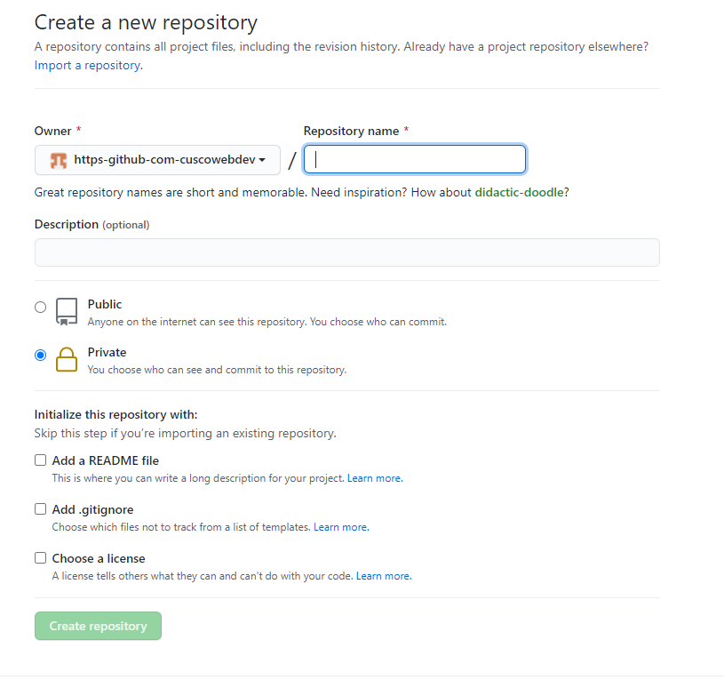

# Trabajo Colaborativo con Git

[Regresar](./README.md)

## Creando una organización

* Nos dirigimos a (https://github.com/settings/organizations) y le damos a *new organization*
* Nos aparecera 3 planes (free, team, enterprise). Seleccionaremos free.
* Rellenamos los datos que nos piden y listo
* Una vez creada la organización, crearemos un nuevo repositorio



## Agregando a gente al repositorio

Para eso nos dirigimos al apartado de *People* y lo que tenemos que hacer es invitarlos, podemos gestionar sus permisos tambien.

## Fork a un proyecto de Github

Cuando estemos trabajando en un repositorio colaborativo los recomendable es que el equipo no haga push de forma directa al repositorio, lo que se recomienda es que cada integrante le saque una copia(fork) y cuando tenga una característica desarrollada recién mande una solicitud a los administradores del repositorio.

> **FORK** es una bifurcación, se entiende que de una rama pricipal se generarán nuevas ramas independientes(copias) a esta.


## Creando repositorios remotos

El administrador del repositorio principal tendra que decidir la forma de trabajo es deci la distriución de las ramas. Un ejemlo sería tener dos ramas, una `dev` y otra la principal(`master`).

Esta distribución indicará a los integrantes del proyecto que suban todos sus cambios a la rama `dev` y que cuando esten desactualizados del proyecto hagan un pull a esa misma rama. 

Entonces los integrantes en su copia(fork) tendrán que agregar repositorios remotos del proyecto principal y de su proyecto personal. Es decir
```
$ git remote -v
organizacion git@github.com:cuscowebdev/jdpoccorieGit.git
organizacion git@github.com:cuscowebdev/jdpoccorieGit.git
personal(origin) git@github.com:jdpoccorie/jdpoccorieGit.git
personal(origin) git@github.com:jdpoccorie/jdpoccorieGit.git
```

> Es una buena práctica que los integrantes no suban cambios directamente a la rama master del repositorio principal

## Pull request

Para hacer pull request cada integrante debera de mandar una solicitud al repositorio principal, es muy importante que mande los cambios a la rama `dev` y no a `master`, esta solicitud sera verificada por el administrador y el decidira si lo confirma o rechaza.

## Etiquetas (releases)

Para crear una etiqueta usamos el comando `git tag "name or version"` 

Para publicar en el repositorio principal usamos `git push origin --tags`

> Una buena practica es crear tags si o si en la rama master por que las etquetas indican que el proyecto llego hasta una version estable

## Git stash

Es un comando que nos permite guardar en memoria cambios incompletos que no queremos perderlos al querer realizar otra accion como por ejemplo navegar entre ramas, hacer un cambio urgente o solucionar algun bug.

Para hacer eso solo ejecutamos el comando `git stash` y se guardaran los cambios que estabamos realizando.

Una vez terminado la otra tarea urgente podemos regresar al punto en donde estabamos y listar los cambios que tenemos guardados con el comando `git stash --list`

Y finalmente para recuperar lo guardado ejecutamos `git stash pop`

## Resumen


1. Crear una organización
2. Crear un proyecto dentro de la organización
3. Si el proyecto es privado agregar a todos los colaboradores
4. Cada colaborador debe de tener un Fork en su cuenta
5. Cada desarrollador debe clonar su fork a su máquina
6. El programador debe agregar los remotos correspondientes del proyecto original
7. Se debe asegurar que todo esté correctamente sincronizado
8. Se creará una nueva rama para trabajar una funcionalidad
9. Una vez terminado el trabajo el desarrollador sube (push) esa rama a su fork
10. En github le aparecerá la opción de crear un Pull Request
11. Una vez creado el pull request el administrador del proyecto original lo revisará
12. Se aprueba o se rechaza el Pull request
13. Cada colaborador debe revisar constantemente(fetch) si no hubo cambios en el proyecto original
14. Se debe eliminar las ramas que ya fueron aprobadas/rechazadas

> Todos estos pasos podemos hacerlo desde @gitlab o @bitbucket, etc.